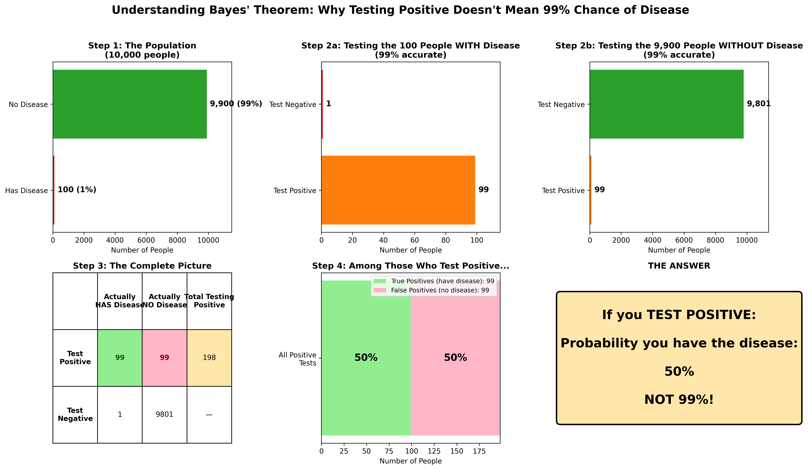
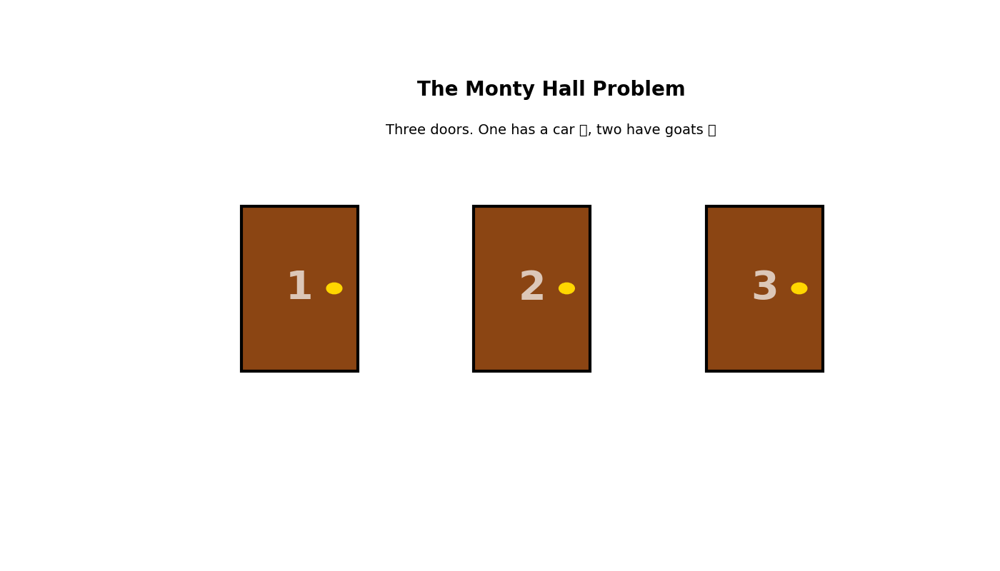

# Bayes' Theorem in Business
# Part A: Bayes' Theorem With A Twist

**MUDT Lecture**
*15th December 2025*

*Press 'S' for speaker notes • Arrow keys to navigate*

---

## Housekeeping

- Lecture is in two parts, around 45 minutes long in total.
- I want to challenge and inspire, not teach all the details.
- If you want more details, there is a repository for code.

Note: Welcome to Part A. In this first 25 minutes, we'll cover foundational concepts that will be essential for Part B.

---

## Learning Objectives

By the end of Part A, you will be able to:

- Explain Bayes' theorem in words, and apply it.
- Give examples of counter-intuitive results.
- Understand and explain useful corollaries of Bayes' Theorem.
- Explain how we use Bayes' Theorem in perception.

---

## What is Bayes' Theorem?

Bayes' Theorem gives us a way to incorporate new evidence into our model of the world.

$$ p(A|B) = \frac{p(B | A) p(A)}{p(B)} $$

 - It's really an identity, a statement about conditional probabilities.
 - It's also controversial because it requires we state a "prior" model.

Note: Start with a broad definition. Ask students what they think Bayes' theorem is before revealing this slide.

---

### Worked Example

**Setup**
 - There is a disease circulating in the population, which affects 1% of people
 - There is a test for this disease which has 99% accuracy - if I have the disease, 99% of the time I will test positive.
 - A patient tests positive, what is the probability they have the disease?

Note: Allow the students 1-2 minutes to think about it.

---

### Explanation
 - $$p(D) = 0.01, p(P | D) = 0.99$$
 - Law of total probability:
   $$p(P) = p(P | D) \cdot P(D) + P(P | \bar{D}) \times P(\bar{D})$$
 - 

   $$\begin{aligned}
   p(D | P) &= \frac{p(D) \cdot p(P | D)}{p(P)} \\
   &= \frac{0.01 \cdot 0.99}{0.01 \cdot 0.99 + 0.99 \cdot 0.01} \\
   &= 0.5
   \end{aligned}$$
   

---

### Visual Explanation

---

### Monty Hall problem

**Setup**

---

### Solution 1

 - Before the host opens a door, $$ p(C_1) = p(C_2) = p(C_3) = \frac{1}{3}$$
 - We picked door 1, so we want $$ p(C_1 | H_3), p(C_2 | H_3)$$
 - Want to compute $$p(C_i​∣H_3​) = P(H_3​∣C_i​)×P(C_i​) / P(H_3​)​$$

---

 ### Solution 2
Three cases to consider:
 - Car behind door 1: $P(H_3∣C_1) = 1/2$.
 - Car behind door 2: $P(H_3∣C_2) = 1$.
 - Car behind door 3: $P(H_3∣C_3) = 0$.

---

### Car behind Door 1.
 - This is the probability of winning if we stick.
 - $P(C_1​∣ H_3​) = \frac{P(H_3​∣C_1​)×P(C_1​)}{P(H_3​)}$
 - $P(H_3​)=P(H_3​∣C_1​)×P(C_1​)+P(H_3​∣C_2​)×P(C_2​)+P(H_3​∣C_3​)×P(C_3​) = \frac{1}{2}​×\frac{1}{3}​+1 \times \frac{1}{3}​​+0×\frac{1}{3}​​$
 - $P(C_1​∣ H_3​) = \frac{\frac{1}{2}​×\frac{1}{3}}{\frac{1}{2}} = \frac{1}{3}$

---

### Car behind Door 2.
 - This is the probability of winning if we stick.
 - $P(C_2​∣ H_3​) = \frac{P(H_3​∣C_2​)×P(C_1​)}{P(H_3)}$
 - $P(C_1​∣ H_3​) = \frac{1​×\frac{1}{3}}{\frac{1}{2}} = \frac{2}{3}$
 - You should **always** switch!

---

### Fallout.
 - This problem appeared in "Parade" magazine in 1990.
 - The setter *Vos Savant* got the answer right. ​
 - Nevertheless, lots of people decided to mansplain to her why she was wrong.

 

---

## Corollaries of Bayes' Theorem
- Uninformative priors / convergence.
- Occam’s razor
- Sherlock Holmes’ principle: the best theory need not be perfect
- Extraordinary claims require extraordinary evidence.

---

### Uninformative priors / convergence.

 - $P(\theta ∣ D) \propto P(D∣\theta)⋅P(\theta)$
 - With lots of data: $P(\theta ∣ D_1​,...,D_m ​) \propto [\underset{i=1}{\overset{m}{\prod}}​ P(D_i​∣\theta)]⋅P(\theta)$
 - $m$ conditional probabilities, only one prior.
 - As long as the prior has **any** weight, it will converge to the right answer.

---

### Occam's Razor.

 - States that "The simplest solution is probably the correct one."
 - Actually a statement about Bayes!
 

---

### Sherlock Holmes' Principle.

"When you have eliminated the impossible, what remains must be the truth".

| Hypothesis | Prior P(H) | Likelihood P(D\|H) | Posterior P(H\|D) |
|------------|------------|-------------------|-------------------|
| H₁: Victim's brother did it | 0.50 | 0.001 (airtight alibi) | ≈0.19 |
| H₂: Random intruder | 0.40 | 0.0001 (no entry possible) | ≈0.02 |
| H₃: Secret passage exists | 0.10 | 0.02 (weird, but fits) | ≈0.79 |

---

#### Calculation for H₃

$$P(H_3 | D) = \frac{P(H_3) \times P(D|H_3)}{\sum_{i=1}^{3} P(H_i) \times P(D|H_i)}$$
$$P(H_3 | D) = \frac{0.10 \times 0.02}{(0.50 \times 0.001) + (0.40 \times 0.0001) + (0.10 \times 0.02)}$$
$$P(H_3 | D) = \frac{0.002}{0.0005 + 0.00004 + 0.002} = \frac{0.002}{0.00254} \approx 0.79$$

**Key Insight:** Despite starting with only 10% prior probability, the secret passage hypothesis jumps to 79% posterior probability because it's the only one that fits the evidence reasonably well.

---

### Extraordinary claims require extraordinary evidence.

An **extraordinary claim** = a hypothesis with a **very low prior** P(H)

To make P(H|D) reasonably high, you need **extraordinarily strong evidence** = very high likelihood ratio P(D|H)/P(D|¬H)

---

### Extraordinary claims require extraordinary evidence.

**Example:**

| Claim | Prior Odds | Evidence Needed (Likelihood Ratio) | To Reach |
|-------|------------|-----------------------------------|----------|
| "I flipped heads" | 1:1 | 1:1 (just show the coin) | ~50% confidence |
| "I flipped 10 heads in a row" | 1:1,023 | ~1,000:1 | ~50% confidence |
| "Telepathy exists" | ~1:1,000,000 | ~1,000,000:1 | ~50% confidence |

---

### Optional Extra: The Bayesian Brain

 - Core idea: The brain functions as a prediction machine that constantly generates probabilistic models of the world, then updates these predictions based on incoming sensory data—essentially performing Bayesian inference in real-time.
 - Perception as inference: We perceive the brain's "best guess" (posterior) combining prior expectations with sensory evidence (likelihood). This explains phenomena like optical illusions (where strong priors override weak evidence) and why context dramatically shapes perception.

Example: When you hear muffled speech, your brain uses priors (language knowledge, context) to "fill in" missing information - this isn't post-processing—it's the fundamental mechanism of all perception and cognition.

---

## Key Takeaways: Part A

- Bayes' Theorem is powerful.
- It leads to non-intuitive results.
- It underpins a lot of "folk wisdom".
- It may be how we perceive the world.

**Coming up in Part B:** How this applies to business.

Note: Take questions before moving to Part B. This is a good break point.

---

## Questions?
